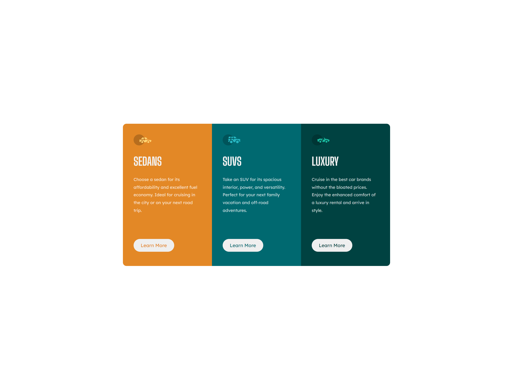
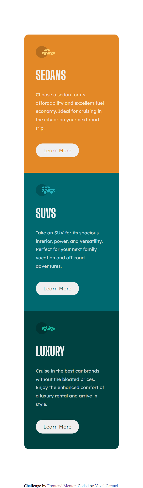

# Frontend Mentor - 3-column preview card component solution

This is a solution to the [3-column preview card component challenge on Frontend Mentor](https://www.frontendmentor.io/challenges/3column-preview-card-component-pH92eAR2-). Frontend Mentor challenges help you improve your coding skills by building realistic projects. 

## Table of contents

- [Overview](#overview)
  - [The challenge](#the-challenge)
  - [Screenshot](#screenshot)
  - [Links](#links)
- [My process](#my-process)
  - [Built with](#built-with)
  - [What I learned](#what-i-learned)
  - [Continued development](#continued-development)
  - [Useful resources](#useful-resources)

## Overview

### The challenge

Users should be able to:

- View the optimal layout depending on their device's screen size
- See hover states for interactive elements

### Screenshot




### Links

- Solution URL: [Solution at GitHub](https://github.com/hoomi88/3-column-preview-card)
- Live Site URL: [Live site](https://hoomi88.github.io/3-column-preview-card/)

## My process

### Built with

- Semantic HTML5 markup
- CSS custom properties
- Flexbox

### What I learned

I have learned a bit more about using flexbox. While using ```@media``` and re-aligning the flexbox from row to column.

```html
<div class="cards">
  <div class="my-card">
  </div>
  <div class="my-card">
  </div>
  <div class="my-card">
  </div>      
</div>
```
```css
.cards {
  display: flex;
  flex-direction: row;  
}
@media (max-width:375px) {
  .cards{          
    flex-direction: column;
  }
}
```

One option for setting different color per each card can be done by applying the color directly in the div style:
```html
<div class="my-card" style="background-color: hsl(31, 77%, 52%);">
</div>
```

### Continued development

Need to continue learning how to align content inside the browser window and also align content withing div.

### Useful resources

As usual:

- [W3SCHOOLS](https://www.w3schools.com/) - very good reference for CSS.
- [MDN Wev Docs](https://developer.mozilla.org/) - More detailed database for all the CSS options.

